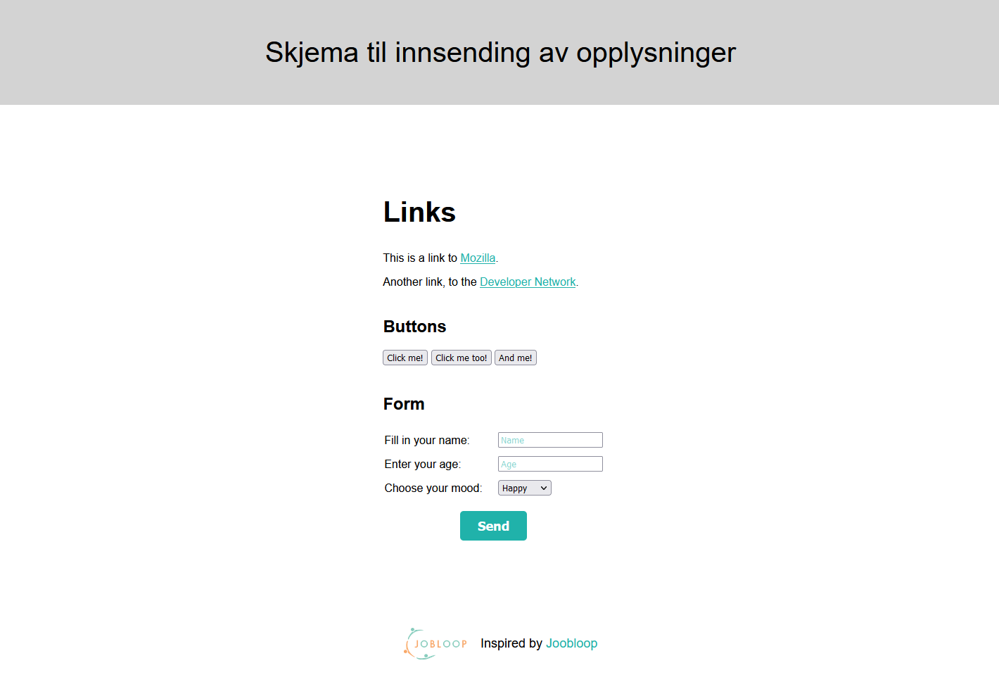

# Skjema til innsending av opplysninger

[Source code](https://github.com/chriskodehub/4-KH_Skjema-til-nnsending-av-opplysninger)  
[Live demo](https://chriskodehub.github.io/4-KH_Skjema-til-nnsending-av-opplysninger/)

## Til innsending og opplysninger
I dag kan du bestille varer på Internett. Når du har bestemt hva du vil kjøpe, må du fylle ut et skjema med navn og adresse, trykke på en knapp, og skjemaet sendes inn. Så går det noen dager og så ligger varene i postkassen din.

## Oppgave 1
I dag vil jeg dere skal leke med koden og prøve å legge inn noen endringer fra tabellen. Koden og tabellen finner du under her.
Lim inn et skjermdump av nettsiden med knappene når du er fornøyd selv og lever i Dokker. 

Læringsmålet er at du forstår hvordan du kan endre på knappene. I morgen bygger vi videre på denne oppgaven og du skal leke deg videre med flere typer knapper og glidere. 

## Answer
